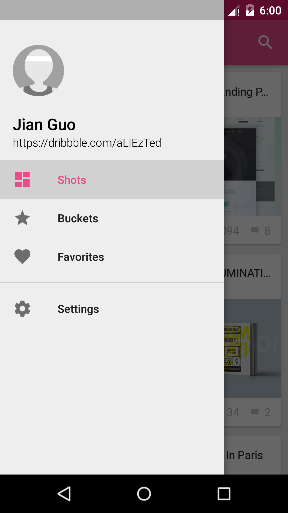
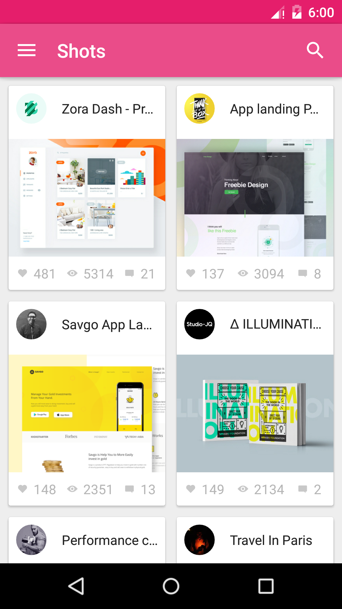
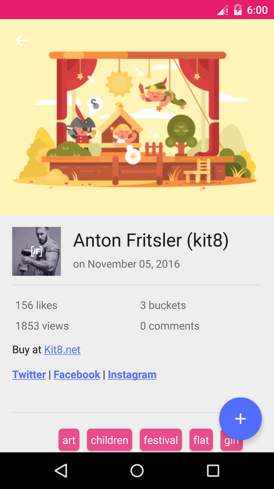

## Simple Dribbble Client using Dribbble api, work in progress 

## Screenshots

Feel free to send me issues and **pull requests**

## TODO list:
* In-App search
* Add unit tests & integration tests
* Embedded with firebase, etc.
* Add more features using Dribbble api

## License

    Copyright 2016 TedaLIEz

    Licensed under the Apache License, Version 2.0 (the "License");
    you may not use this file except in compliance with the License.
    You may obtain a copy of the License at

       http://www.apache.org/licenses/LICENSE-2.0

    Unless required by applicable law or agreed to in writing, software
    distributed under the License is distributed on an "AS IS" BASIS,
    WITHOUT WARRANTIES OR CONDITIONS OF ANY KIND, either express or implied.
    See the License for the specific language governing permissions and
    limitations under the License.